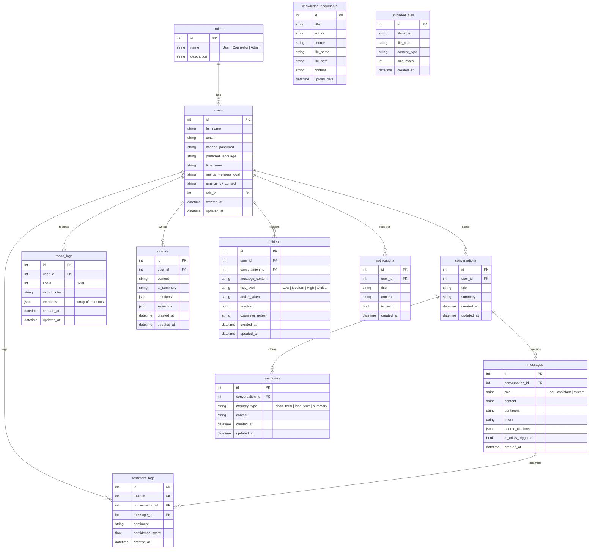
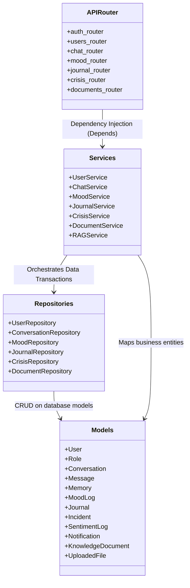
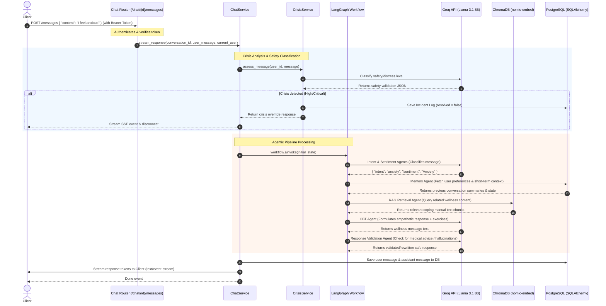

# 🧠 Emora System Design Diagrams

This document contains Mermaid diagrams illustrating the Architecture, Entity Relationships, and Pipeline Flow of the Emora Mental Health Chatbot backend.

---

## 📊 Entity Relationship (ER) Diagram

Below is the database schema mapping the entity relationships of the PostgreSQL database.

---

## 🛠️ Class & Architectural Layer Diagram

Emora follows a strict **Controller-Service-Repository** pattern. Database interactions occur strictly in Repositories. Business logic resides in Services. API Routing is handled in Versioned Routers.

---

## 🔄 Sequence Diagram: End-to-End Chat & Agentic Pipeline

The diagram below details the sequence of execution when a client posts a new user message to the chat endpoint. It highlights how the message is validated, classified, contextualized, processed by specialist LLM agents via `LangGraph`, saved to SQL, indexed in ChromaDB, and streamed back using Event Source (SSE).

